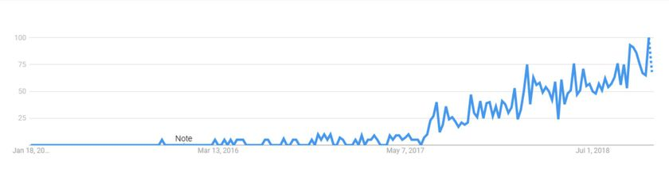

Gatsby should be a modern framework for the fast websites. Project was born in May 2015 as a simple way to build a website with React.

But become increasingly popular around mid 2017. 



This is just a first test page, and it will not give you much about Gatsby. So, maybe I need a todo list of what I want to achieve?

Here it is: 
- Installation - Setup/Templates/Plugins...

  Everything starts with:
  ```bash
  $ npm init gatsby
```
- Assembling bits - trying to find the relation between React components, static `.md` files and data.
- Exploring Gatsby and GraphQL 
- Running - trying different scripts
- Deployment - Deployment to Github pages / Automated scripts 
- Issues 
  - protocols - 
  - long paths - it seems that some pre-processor is needed for links, they do not convert correctly 
  - prefix - ?
...

<br/>
<br/>

For future references use the following:
- [Gatsby Official Website](https://www.gatsbyjs.com/)
- [Gatsby Quick Start](https://www.gatsbyjs.com/docs/quick-start/)
- [Gatsby Templates](https://www.gatsbyjs.com/starters/?)
