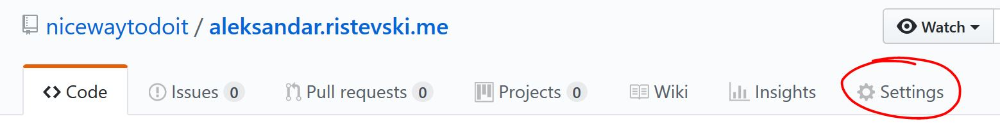

So, what do you need to do first?

* Go to your repositories:
[https://github.com/\<your-username\>?tab=repositories](https://github.com/nicewaytodoit?tab=repositories)

* Choose the repository you want deploy (in my case): aleksandar.ristevski.me 

* Go to `Settings` tab of the project:


* In Settings you will find block `GitHub Pages` there you can choose what branch is the branch you will use to deploy to you hosting site.
  - minimum requirement in order to host is to have `index.hml` file.
  - when you choose your deployment branch GitHub will give you a link to your hosted project. For example:<br/>
  After adding "index.html" file and choosing "master" branch we get message:<br/><br/>
  <span style="background:#dcffe4;padding:7px;border: 1px solid #d1d5da;font-size:0.8em;">
    Your site is ready to be published at [https://nicewaytodoit.github.io/pgs-test/](https://nicewaytodoit.github.io/pgs-test/)
  </span><br/>
* You can use any branch as deployment branch, but widely addopted way is to use orphan branch called `gh-pages`
  - How to create `gh-pages` orphan branch?
    ```bash
    $ git checkout master
    $ git ls-files
    $ git checkout --orphan gh-pages
    $ git rm -rf .
    $ echo "# My orphan ReadMe" > ReadMe.md
    $ git add ReadMe.md
    $ git commit -a -m "Initial commit"
    $ git status
    $ git log --oneline --graph
    $ git checkout master
    $ git log --oneline --graph
    $ git push
    ``` 
* For additional tutorials and documentation go to: [https://pages.github.com/](https://pages.github.com/)

