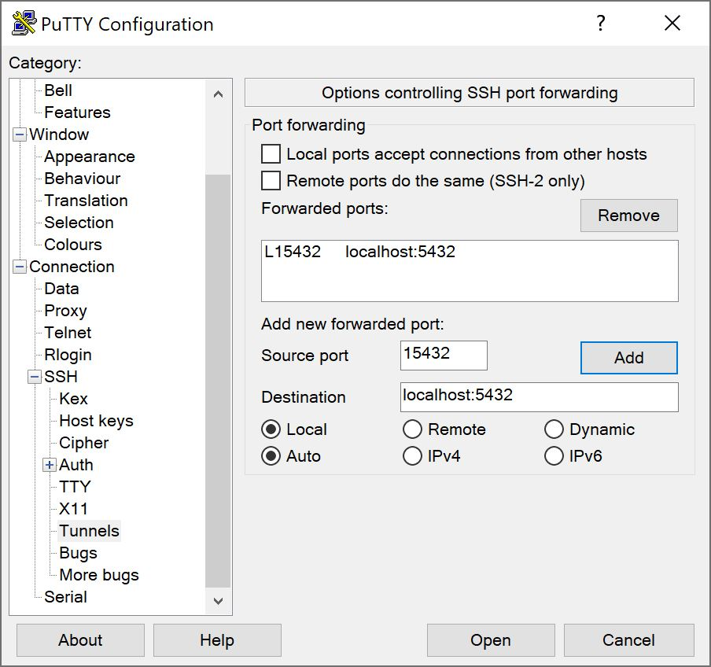

PostgreSQL, also known as Postgres, is a free and open-source relational database management system, which is extensible and SQL compliance. The initial release was 8 July 1996, and the new version 13 was released on 24 Sep 2020. 
## Installation 

This installation is covering Ubuntu 20.04 and 18.04, which is a very frequent choice for AWS EC2 instances. 

First, we need to check are `vim`, `bash-completion` and `wget` installed and up to date, following downloading and adding `apt` repository keys.

```bash
$ sudo apt -y install vim bash-completion wget

$ wget --quiet -O - https://www.postgresql.org/media/keys/ACCC4CF8.asc | sudo apt-key add -

$ echo "deb http://apt.postgresql.org/pub/repos/apt/ `lsb_release -cs`-pgdg main" |sudo tee  /etc/apt/sources.list.d/pgdg.list
```

Next, we need to update the package index, following by PostgreSQL installation. 
```bash
$ sudo apt update
$ sudo apt install postgresql-13 postgresql-client-13
```

After the successful installation, we will get a message about the main server configuration settings:

> Ver Cluster Port Status Owner    Data directory              Log file
> 13  main    5432 down   postgres /var/lib/postgresql/13/main /var/log/postgresql/postgresql-13-main.log

During the installation, PostgreSQL service is started and set to start up after every system reboot.

We can check service status with the following commands: 
```bash
$ systemctl status postgresql.service 

$ systemctl status postgresql@13-main.service 

$ systemctl is-enabled postgresql
enabled
```

## Initial Configuration

Ubuntu user `postgres` that has the `superadmin` rights over the entire PostrgreSQL was automatically created during the installation part. 
It is advisable to change `postgres` database user password immediately after installation by running: 

```bash
sudo su - postgres
psql -c "ALTER USER postgres WITH PASSWORD 'P@sswr0d4PostgresUser'"
```

Optionally we should delete the history line that contains our password change `history -d 1`.

Then we can run SQL prompt by running:
```bash
$ psql
```

Which will display a message similar to the following:
```sql
psql (13.0 (Ubuntu 13.0-1.pgdg18.04+1))
Type "help" for help.

postgres=#
```

### Create DB and user for DB

To get connection details, type the following:
```bash
postgres=# \conninfo

You are connected to database "postgres" as user "postgres" via socket in "/var/run/postgresql" at port "5432".
```

Create a new database by typing:
```SQL
postgres=# CREATE DATABASE dbexample;
-- CREATE DATABASE
```

Create a new user we can use coupled with the example database we just created above.
```SQL
postgres=# CREATE USER exampleuser WITH ENCRYPTED PASSWORD 'MyExampl3UserPass';
-- CREATE ROLE
```

Next, we will grant all privileges on the example database to the newly created user. The original `postgres` user already has ownership and supper admin rights on all databases, so this new user we can fine-tune to the database needs.  
```SQL
postgres=# GRANT ALL PRIVILEGES ON DATABASE dbexample to exampleuser;
-- GRANT
```

### List all databases 

While in prompt type command `\l`

```prompt
postgres=# \l
                               List of databases
   Name    |  Owner   | Encoding | Collate |  Ctype  |    Access privileges    
-----------+----------+----------+---------+---------+-------------------------
 dbexample | postgres | UTF8     | C.UTF-8 | C.UTF-8 | =Tc/postgres           +
           |          |          |         |         | postgres=CTc/postgres  +
           |          |          |         |         | exampleuser=CTc/postgres
 postgres  | postgres | UTF8     | C.UTF-8 | C.UTF-8 | 
```

### Connect to Database

A connection with the database will be established with the default `postgres` user by executing the following command.

```
postgres-# \c dbexample
You are now connected to database "dbexample" as user "postgres".
```

If we want to connect with a different user we can type:
```
postgres-# \c dbname username
```

Connect has a following signature:
```
\c or \connect [ -reuse-previous=on|off ] [ dbname [ username ] [ host ] [ port ] | conninfo ]
``` 

### Few additional commands that may be useful to know

| Commands             |  description
-----------------------|-------------------------------------
|\d __=table=__          |  Show table definition including triggers	            
|\dn                   |  Listar Schemas	            
|\df                   |  List functions	            
|\dv                   |  List views	            
|\df+ __=function=__       |  Show function SQL code	            
|\x                    |  Pretty-format	            

To learn more, check the official documentation [here](https://www.postgresql.org/docs/13/app-psql.html).

### Quitting PSQL prompt

Lastly, to quit prompt use the following:
```
postgres-# \q
```


### Linux equivalent commands 
It is possible to achieve the above without using `psql` prompt by using equivalent shell commands:

```bash
postgres@ubuntu:~$ createuser exampleuser --password
postgres@ubuntu:~$ createdb dbexample -O exampleuser
postgres@ubuntu:~$ psql -l 
```


## Connecting to remote PostgreSQL from local machine (Win/Linux)

Frequent solution to connect to PostgreSQL database is to allow remote server by editing config file: 

```bash
$ sudo nano /etc/postgresql/13/main/postgresql.conf 
```

```conf
# Listen on all interfaces
listen_addresses = '*'

# Listen on specified private IP address
listen_addresses = '192.168.10.11'
```

After config has been changed, we will need to restart PostgreSQL service:

```bash
sudo systemctl restart postgresql
```

At the end we need to check whether service listening on appropriate ports:
```bash
$ netstat  -tunelp | grep 5432

tcp   0   0   0.0.0.0:5432   0.0.0.0:*   LISTEN  111  112837  11143/postgres      
tcp6  0   0   :::5432        :::*        LISTEN  111  112838  11143/postgres   
```

## PuTTY tunnel to EC2 PostgreSQL

Another way is to connect from the local machine to the remote server by creating SSH tunnel. Using PuTTY, we can create the local port bridging to the remote server and then use the local pgAdmin to manage the server's database. 

### PuTTY / SSH

In PuTTY's configuration screen go to:

> Connection > SSH > Tunnels > Add new forwarded port:

For `Source port` enter 15432 (or any other available port in your local)
and for `Destination` enter localhost:5432 (if 5432 port is the PostgreSQL port defined on your remote server).

Click `ADD` and record will be added to `Forwarded ports:` list.

Make sure that settings below destination are `local` and `auto`.



Go back to PuTTY `Session`, load your server details and click `Open`.


### pgAdmin 4 connecting from client to remote server

Now only left is to open pgAdmin (4) go to tree root `Servers` right click and choose:

> `Create > Server...`

In the `General` tab choose name for the server connection `MyRemoteEC2Server`, choose group, and switch to `Connection` tab.

In `Connection` tab populate for:

- **Host name/address:** localhost
- **Port**: 15432 *(this is a "bridge" port we created earlier with PuTTY)
- **Maintenance database**: dbexample
- **Username**: exampleuser
- **Password**: *ThatUs3rP@ssw0rd*

Be careful with what user you connecting as it can have limited permissions, so from time to time, for a database backup and restore purposes you will need to connect with:

- **Maintenance database:** postgres
- **Username**: postgres


