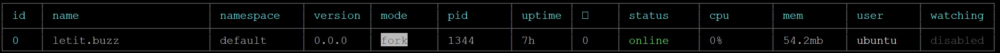

First, we need to ask what is PM2? 

So, in their makers own words: "PM2 is a daemon process manager that will help you manage and keep your application online" or in other words it is an app which is used to keep your Node.js application server (web app) alive even in the case when something goes wrong as application crash server is restarted and similar. 

PM2 has: load balancer, logs facility, startup script, microservice management and many other easily accessible functionalities necessary for the production environment.

Considering that you already have a web application up and running let's switch to PM2, if not there is a tutorial on how to create an [Express.js web app running on Nginx](/posts/2020-11-19---expressjs-web-app-running-on-nginx/) you can quickly go through.

## Basic Setup 

So, to install PM2 run the following:

```bash
$ npm install -g pm2@latest
```

[comment]: # (+ pm2@4.5.1 > added 198 packages from 195 contributors in 5.628s)

After PM2 is installed, a new folder `.pm2` will appear in our `/home/<user>` folder. In it there will be logs, and other PM2 files. Remember this we will need it later. 

Being globally available (`-g` flag), at your exposal there are the following commands:

From within the folder of your application you can simply start your application by typing: 
```bash
$ pm2 start app.js -i 0
```

To check all running processes you can use:
```bash
$ pm2 list
```
which will give you something like:


To get application console logs and errors we can use:
```bash
$ pm2 logs
```

To monitor a process, which will give us more details:
```bash
$ pm2 monit
```
It has a bit more functionality and it is possible to see logs, but those logs are not persistent as soon as we switch to other process logs will be wiped out, generally used to replicate some issue. 


To stop all applications:
```bash
$ pm2 stop all
```

To delete all currently running processes, which is useful if you running your apps from the `ecosystem` file:
```bash
$ pm2 delete all
```

It is possible to delete a specific process using its name:
```bash
$ pm2 delete letit.buzz
```

And of course if processes are stopped we can use the following command to run them again:
```bash
$ pm2 start all
```

This, apart of `start-up` we will cover later, above is enough for the basic scenario, so now let explore a bit more.  


## A Little Bit More Complex Setup
Usually, when we are running in production, we will need to deal with multiple applications running at the same time, and each application will have different requirements, so let's explore a more complex scenario. 

First of all, it is out of the question to run all the time a bunch of Linux commands, so we will need to automate a process we need some kind of config. 


If we run:
```bash
$ pm2 ecosystem 
```
it will generate an example `ecosystem.config.js` in our case we do not need *deploy* config block for now - we will cover it some other time. 

I would like to emphasize that location from where you are running pm2 and where the ecosystem file is placed is important. The general advice is to keep an ecosystem file in the root of the web content `/var/www`.

```js
module.exports = {
    apps: [
        {
            name: 'letit.buzz',
            script: './letit.buzz/app.js',
            args: 'LetITbuzz',
            instances: 1,
            exec_mode: 'fork',
            env: {
                NODE_ENV: 'development',
                PORT: 8007,
            },
        },
        {
            name: 'abc.com',
            script: './abc.com/app.js',
            args: 'ABC-1',
            instances: 2,
            watch: true,
            watch_delay: 1000,
            ignore_watch: ['.git', 'node_modules'],
            exec_mode: 'cluster',
            env_production: {
                NODE_ENV: 'production',
                PORT: 8005,
            },
            env: {
                NODE_ENV: 'development',
                PORT: 8005,
            },
        }
    ]
}
```

Let's se what is what.

- **name** - is the process name it will help you to locate the application in the `pm2 list` or to manipulate it if needed by `pm2 start/delete...`.
- **script** - is the location of your application, when you navigate it is from the location of your ecosystem file.
- **args** - can be useful if you want to pass arguments to your node.js application that you can handle with line like `const [,,firstArgument] = process.argv;`
Except passing arguments using ecosystem file it is possible to do it directly using the following:
```bash
$ pm2 start app.js -- aa bb cc
$ pm2 restart app.js -- 11 22 33
```
as described [here](https://github.com/Unitech/pm2/issues/13).

- **exec_mode** - by default application runs in 'fork' mode but if you want to utilize processing power of your server you will use 'cluster' if you use cluster mode then the next parameter is important.

- **instances** - if you choose 'max' or '0', PM2 will create maximum threads/cores available, any other number will create equal number of instances of your application.

- **env** - another way to pass arguments on the start to the application is with environment variables, except using Linux command `export NAME=VALUE` is to adjust them in ecosystem  file. Whatever we set in `env:` block will be directly accessible from JavaScript code by using a following pattern `process.env.PORT`, `process.env.NODE_ENV`. 
It is possible to create an option block as `env_production`, `env_something` but those will not be directly accessible from our node.js app. The only way to use them is to pass desired environment on the start as `pm2 start ecosystem.config.js --env production`. 

If there is a requirement to pass multiple values, maybe the good option would be to use `.json` file

For instance, we could create a `config.json` file with:
```json
{
   "dev": {
        "psql": {
            "connection": "host=localhost port=5432 dbname=buzz user=john"
        },
        "redis": {
            "hosts": ["localhost"]
        }
   },
   "production": {
        "psql": {
            "connection": "host=192.168.7.11 port=5432 dbname=buzz user=admin"
        },
        "redis": {
            "hosts": ["8.8.8.8"]
        }
   }
}
```
Next inside of JavaScript file we can consume json by loading specific values:

```js
var config = require('./config.json')[process.env.NODE_ENV || 'dev'];
db.connect(config.psql.connection, config.redis.hosts);
```

for the given `NODE_ENV` value we would set via shell:

export NODE_ENV=staging
pm2 start app.js

or changing values in `ecosystem` within `env` config block as:
```js
module.exports = {
    apps: [
        {
            ...
            env: {
                NODE_ENV: 'dev',
            },
```

- **watch** - this is very similar to watch options with `nodemon` where overall idea is to track code changes, so after the new deployment process will automatically restart newly updated application. Along with `watch: true` we need to set `ignore_watch: ['.git', 'node_modules']` parameter which will ignore unnecessary files in our application folder. Lastly, there is `watch_delay` which is I guess (in lack of documentation) a number in milliseconds that will delay restart after a change. This can be useful if we copying multiple files.

Except defining these in the `ecosystem` file it is possible to pass them inline as:

```bash
$ pm2 start env.js --watch --ignore-watch="node_modules"
```


## Startup
Now, when we know how to setup multiple applications and how to run pm2, it is only left to see how to handle unexpected server reboot.

Type the `pm2 startup` command without `sudo` and it will spill out exactly what you need to execute next: 

```bash
$ sudo env PATH=$PATH:/home/<user>/.nvm/versions/node/v12.7.1/bin /usr/lib/node_modules/pm2/bin/pm2 startup systemd -u <user> --hp /home/<user>
```

`<user>` will be the user you are using to run the applications. Copy and paste that entire line as you have it in your SSH press enter. After this you need to save current pm2 process list with:

```bash
$ pm2 save
```
You will get a following message saying that `dump.pm2` file is created.
```bash
[PM2] Saving current process list...
[PM2] Successfully saved in /home/<user>/.pm2/dump.pm2
```

The dump file and all the log files will be in `~/.pm2` folder.

If there is a need to update Node.js to newer version or update the PM2 startup script use `$ pm2 unstartup systemd` and then repeat the above process.

Only left is to test that your application will run after reboot, for that one you can use:

```bash
$ shutdown -r now
```

! Important: 
When you rebooting, pm2 will not restart from your `ecosystem.config.js` file but from the dump.pm2 file, replicating processes as they were. That being said it is important to remember when you make changes to ecosystem file you will need to delete all processes start pm2 with ecosystem file.
```bash
$ pm2 delete all 
$ pm2 start ecosystem.config.js.
```
In the end, you will need to `pm2 save` again to capture the current state of processes crating a new dump file. 


Next time I will try to cover **deployment** and **logging** with pm2 until then there are few resources you can check:

- [PM2 Documentation](https://pm2.keymetrics.io/docs/usage/pm2-doc-single-page/)
- [PM2 Deployment](https://pm2.keymetrics.io/docs/usage/deployment/)
- [PM2 Log Management](https://pm2.keymetrics.io/docs/usage/log-management/)

