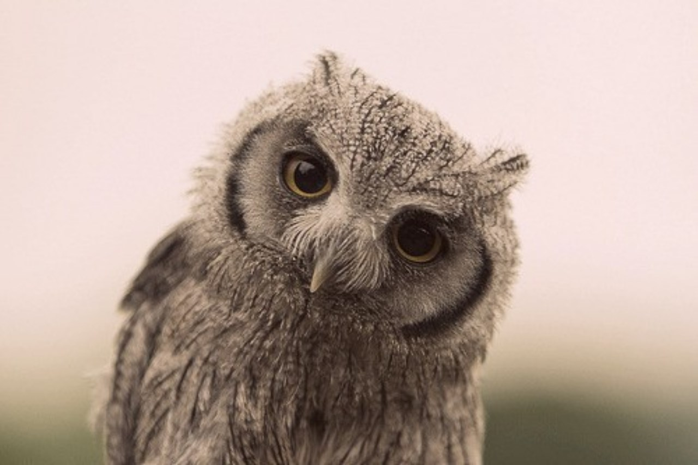

**[Craft](https://www.merriam-webster.com/dictionary/craft)** <em>by Merriam Webster Dictionary</em> 
&nbsp;&nbsp;&nbsp; : to make or produce with care, skill, or ingenuity 
&nbsp;&nbsp;&nbsp; : skill in making things especially with the hands 
          

Programming is a beautiful craft that does not require much, you need a computer and a logically functional brain. It largely depends on someone's talent but also a willingness to dedicated enough hours shaping his mind as a tool of the trade. Even when things falling apart, even when requirements look impossible, in some strange way it is ok, those things make our job interesting. Solving those everyday Gordian knots and small puzzles makes our work satisfying.

The development makes a great portion of my life but it is not all. There are days, I do not want to touch a keyboard or look at anything that has a screen. To be successful at what you do it is necessary to rest, as it gives our brains time to reorganize and find solutions. To solve hard problems we have to look outside of the box, and it is easier to do that if we don't constantly look through the same frame.

Indoors, when I am not coding, you will find me drawing, or playing with Fusion 360 and having a very live argument with my 3d printer. From time to time I read a random recommended novel, or watch some Sci-fi movie or series (no I have not watched Lost, one has to draw a line somewhere).

English is my second language, as a way to improve my language skills, from time to time I will make youtube clips, or write different essays on a range of topics, posting them on a few of my blogs. No, I am not a writer, I just write. 

In that regard, I can relate to Alan Watts philosophical impression that we should not identify with the things we do - therefore, we are not programmers, writers, travelers... but, instead, beings of infinite potential choosing to do things as coding, writing, singing, drawing, running... meaning we are are not 'nouns' but 'verbs'.

Equally being saturated as with the tech, when I get enough of being indoors, I like being lost in urban exploring, architecture, galleries, museums, theatres, I don't mind pint or two but I am not much of a drinker. Traveling is way to shift your perspective, changing cultural context can reveil much about your self, and open doors for new ideas.

● Archery, hiking, long walks, meditation

